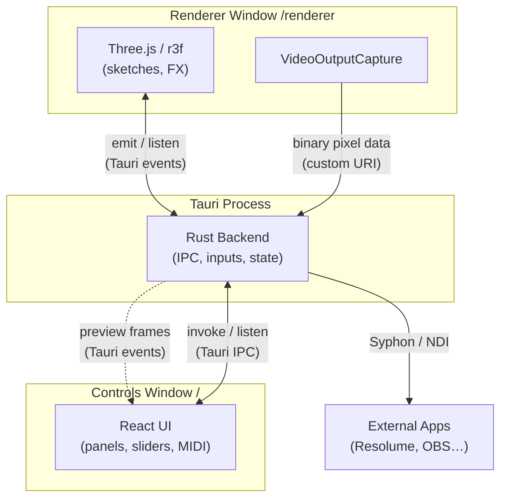
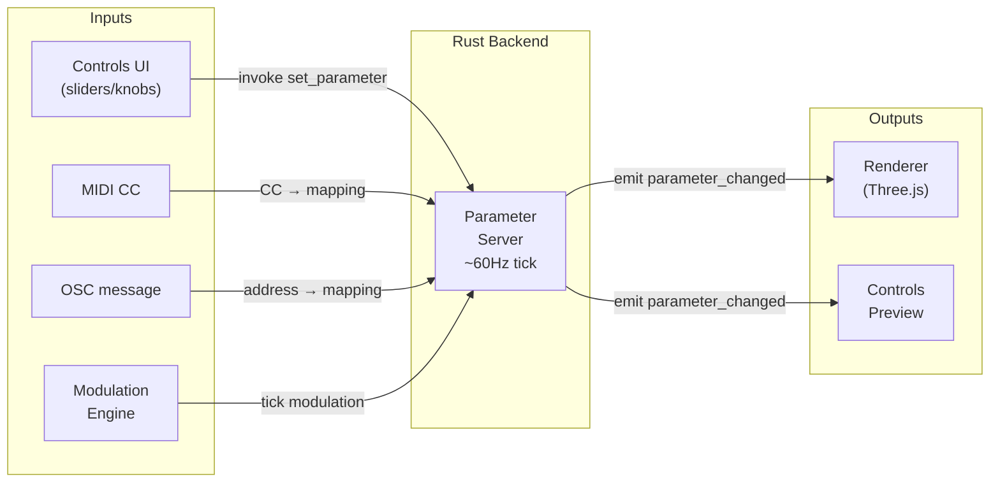
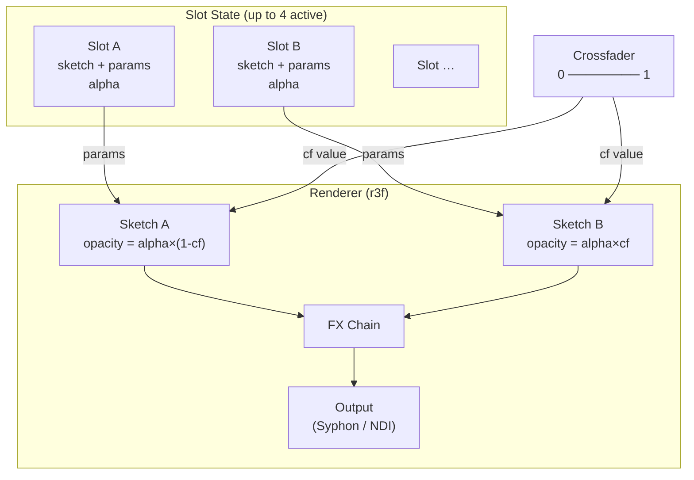
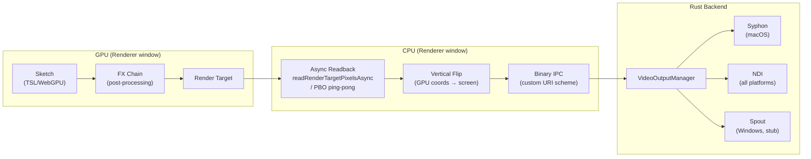

# Architecture

System design and conventions for Slew.

---

## Overview

A modular VJ engine built on **Tauri v2**, using a dual-window architecture:

- **Renderer Window**: High-performance visual output (React + Three.js/r3f)
- **Controls Window**: UI dashboard for parameters, scenes, and input devices

The Rust backend handles input processing (OSC, MIDI, Audio, HID), state management, modulation, transitions, and inter-window messaging.

---

## Technology Stack

| Layer             | Technology                                                     |
| ----------------- | -------------------------------------------------------------- |
| Application Shell | Tauri v2 (Rust + WebView)                                      |
| Frontend          | React + TypeScript + Vite                                      |
| Styling           | CSS Modules + CSS Variables                                    |
| 3D Rendering      | Three.js via react-three-fiber                                 |
| Shaders           | TSL (Three.js Shading Language) for WebGPU                     |
| GPU Backend       | WebGPU (Metal on macOS), WebGL2 fallback                       |
| Video Output      | Syphon (macOS), Spout (Windows), NDI (cross-platform)          |
| Input             | MIDI (midir), OSC (rosc), Audio (cpal + rustfft), HID (hidapi) |

---

## Window Architecture

### Renderer Window (`/renderer`)

**Purpose**: Display visuals at high FPS with no UI overhead.

- Runs full-screen or borderless
- Dedicated render loop using r3f
- Receives parameter updates from backend via events
- Renders all slots with alpha > 0 simultaneously
- Exposes frames via Syphon/NDI for VJ software integration

**Constraints**:

- No React DevTools or inspector
- No blocking async operations
- Isolated from UI to prevent frame drops

### Controls Window (`/`)

**Purpose**: VJ dashboard for live control.

- Slot management with inline sketch browser
- Parameter sliders (auto-generated from sketch descriptors)
- MIDI Learn UI for knob/pad mapping
- Audio input configuration
- Crossfade controls
- Device status panels

Both windows share the same frontend bundle; `src/main.tsx` dispatches based on path.



---

## Core Systems

### Parameter Server

Central authority managing all visual parameters.

- Located in `src-tauri/src/lib.rs`
- ~60Hz tick loop for smooth transitions
- Parameters have `value`, `target`, `transition_speed`, and `curve`
- Persistence to `parameters.json`
- Events: `parameter_changed`, `parameters_cleared`

**Parameter flow:**



### Slot System

**Terminology**:

- **Slot**: Numbered container (0-7) that holds a sketch
- **Sketch**: Visual program (e.g., `BlueCube`, `TslNoiseBlob`)

Key characteristics:

- 8 fixed slots always visible in UI
- Empty slots show inline sketch browser with grouped sections
- Same sketch can exist in multiple slots with independent parameters
- Parameter IDs: `slot_{index}_{templateId}` (e.g., `slot_0_brightness`)
- Slots layer in index order (slot 0 = back, slot 7 = front)
- Persistence to `slots.json`



### Input Systems

All inputs follow the same pattern:

1. Rust module with device management
2. Tauri commands for CRUD
3. TypeScript hooks
4. UI panel in Controls sidebar

| System | Module   | Key Features                                                       |
| ------ | -------- | ------------------------------------------------------------------ |
| MIDI   | `midi/`  | Learn mode, mappings persisted, Midimix integration, soft takeover |
| OSC    | `osc.rs` | UDP server (port 9000), address → parameter mappings               |
| Audio  | `audio/` | FFT, beat detection, audio → parameter mappings                    |
| HID    | `hid/`   | Macropad support (DOIO Megalodon)                                  |

### Modulation Engine

Backend-driven modulation for deterministic behavior (`modulation.rs`):

- LFO sources: Sine, Triangle, Saw, Square, Random
- BPM sync option
- Any LFO can target any parameter
- Audio can modulate LFO properties

### Video Output

High-performance frame capture from WebGPU/WebGL sent to Rust backends (`video_out.rs`):

**Backends:**

- **Syphon** (macOS): Native bindings via `objc2` + CGL
- **NDI** (cross-platform): `grafton-ndi` crate
- **Spout** (Windows): `spout-rs` crate (wraps Spout2 via `cxx` C++ bridge)

**Optimizations (see `docs/finished/VIDEO_OUTPUT_OPTIMIZATION.md`):**

- **WebGPU async readback**: `readRenderTargetPixelsAsync()` for non-blocking GPU→CPU transfer
- **Binary IPC protocol**: Raw pixel data via custom URI scheme, bypasses JSON/base64
- **PBO fallback**: Ping-pong Pixel Buffer Objects for WebGL2 async readback
- **Pre-allocated buffers**: Reuses memory to avoid per-frame allocations

**Data flow:**



**Performance:** Stable 60fps at 1080p with Syphon output.

### Preview Streaming

Stream rendered frames from Renderer to Controls window for pixel-perfect previews (`frame_distribution.rs`):

**Architecture:**

- Composited frames captured alongside video output, distributed via Tauri events
- Per-slot frames captured via visibility toggling (isolate one slot, render to offscreen target)
- Controls window receives frames and updates WebGL textures in real-time
- Automatic fallback to local rendering when streaming unavailable

**Components:**

- `SlotPreviewCapture.tsx`: Round-robin slot capture in Renderer window
- `StreamedPreview.tsx`: Texture display component for Controls window
- `frame_distribution.rs`: Backend frame routing and statistics

**Optimizations:**

- Round-robin capture: One slot per frame to minimize GPU overhead
- Debounced resize: Texture recreation delayed during window resize
- Configurable FPS: Default 30fps for previews (configurable via backend)
- Resolution scaling: 50% scale for slot previews to reduce bandwidth

**See:** `docs/finished/PREVIEW_STREAMING.md` for full implementation details.

---

## Project Structure

```
/project
  /src
    /sketches/              # Visual programs (grouped modules)
      /{GroupName}/         # Group folder (e.g., Examples, Effects)
        index.ts            # SketchGroup definition + re-exports
        /{SketchName}/
          index.tsx         # Component + SketchDescriptor
      index.ts              # SKETCH_GROUPS, SKETCH_REGISTRY
      types.ts              # SketchDescriptor, SketchGroup, SketchProps
    /components/            # React UI components (grouped by concern)
      /parameters/          # Parameter editing widgets (sliders, knobs, color pickers, etc.)
      /slots/               # Slot management UI (SlotsArea, SlotColumn, SlotParameterControls)
      /panels/              # Sidebar panels (MIDI, OSC, Audio, HID, Modulation, Video, WLED)
      /preview/             # Preview components (RendererPreview, StreamedPreview)
      /layout/              # App-level layout (Sidebar, Toolbar, Button, ShortcutsModal, UpdateBanner)
      index.ts              # Public barrel — import all components from here
    /inputs/                # MIDI, OSC, Audio, HID hooks
      /shared/              # Reusable hook infrastructure
    /outputs/               # Video output hooks (Syphon/Spout/NDI, WLED)
    /hooks/                 # Shared React hooks (useParameterStore, useSlotColors, etc.)
    /lib/                   # Pure utility modules (color.ts, storage.ts, logger.ts)
    /renderer/              # Renderer window (RendererRoot, VideoOutputCapture, SlotPreviewCapture)
    /slots/                 # Slot system utilities
      slotTypes.ts          # Parameter ID utilities
      useSlots.ts           # Slot state management
  /src-tauri/               # Rust backend
    /src/
      lib.rs                # Parameter server, tick loop, commands
      window_manager.rs     # Window lifecycle, heartbeat, native menu
      /common/              # Shared utilities
        persistence.rs      # JSON I/O helpers
        events.rs           # Event emission helpers
      /midi/                # MIDI device management (13 modules)
      /audio/               # Audio capture, FFT, beat detection (11 modules)
      /hid/                 # HID/macropad support (11 modules)
      osc.rs                # OSC server
      modulation.rs         # LFO engine, modulation matrix
      video_out.rs          # Video output backends
      frame_distribution.rs # Preview frame distribution to Controls
      syphon.rs             # Native Syphon bindings (macOS)
      spout.rs              # Spout sender wrapper via spout-rs (Windows)
  /docs/                    # Documentation
    /finished/              # Archived task documents
  /scripts/                 # Build and setup scripts
```

---

## Code Style

See [`docs/CONVENTIONS.md`](CONVENTIONS.md).

---

## Key Files Reference

| File                                  | Purpose                                             |
| ------------------------------------- | --------------------------------------------------- |
| `src-tauri/src/lib.rs`                | Parameter Server, tick loop, command registration   |
| `src-tauri/src/window_manager.rs`     | Window lifecycle, heartbeat monitoring, native menu |
| `src-tauri/src/common/`               | Shared utilities (persistence, events)              |
| `src-tauri/src/midi/`                 | MIDI device management, Midimix integration         |
| `src-tauri/src/audio/`                | Audio capture, FFT, beat detection                  |
| `src-tauri/src/hid/`                  | HID/macropad support                                |
| `src-tauri/src/modulation.rs`         | LFO engine, modulation matrix                       |
| `src-tauri/src/video_out.rs`          | Video output backends                               |
| `src-tauri/src/syphon.rs`             | Native Syphon bindings (macOS)                      |
| `src-tauri/src/spout.rs`              | Spout sender wrapper via `spout-rs` (Windows)       |
| `src-tauri/src/frame_distribution.rs` | Preview frame distribution to Controls window       |
| `src/sketches/`                       | Grouped sketch modules                              |
| `src/slots/useSlots.ts`               | Slot management hook                                |
| `src/inputs/shared/`                  | Reusable hook infrastructure                        |
| `src/hooks/useParameterStore.ts`      | Parameter state                                     |
| `src/renderer/RendererRoot.tsx`       | Multi-slot rendering loop                           |
| `src/renderer/SlotPreviewCapture.tsx` | Per-slot frame capture for preview streaming        |
| `src/renderer/VideoOutputCapture.tsx` | Frame capture for Syphon/Spout/NDI + composited preview |
| `src/components/preview/StreamedPreview/` | Streamed frame display in Controls window       |
| `src/components/slots/SlotColumn/`   | Slot UI with inline sketch browser                  |

---

## Planned Work

See [`docs/BACKLOG.md`](BACKLOG.md).
