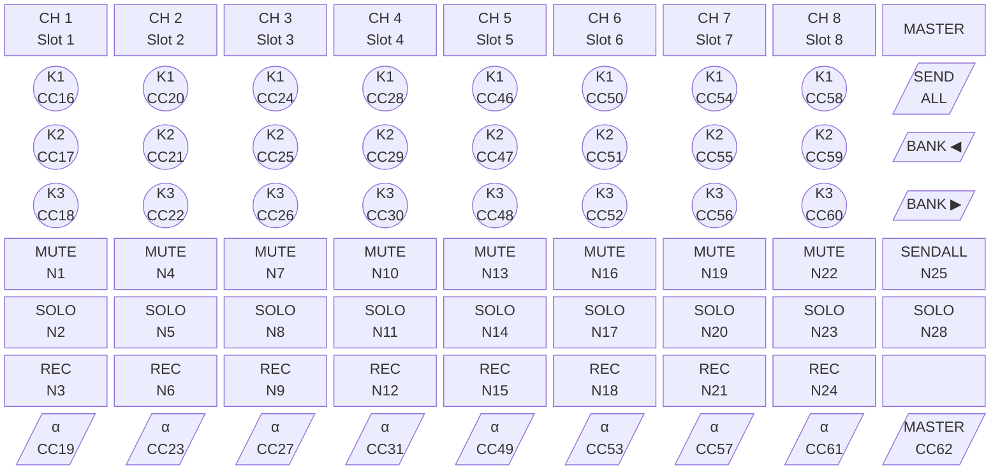
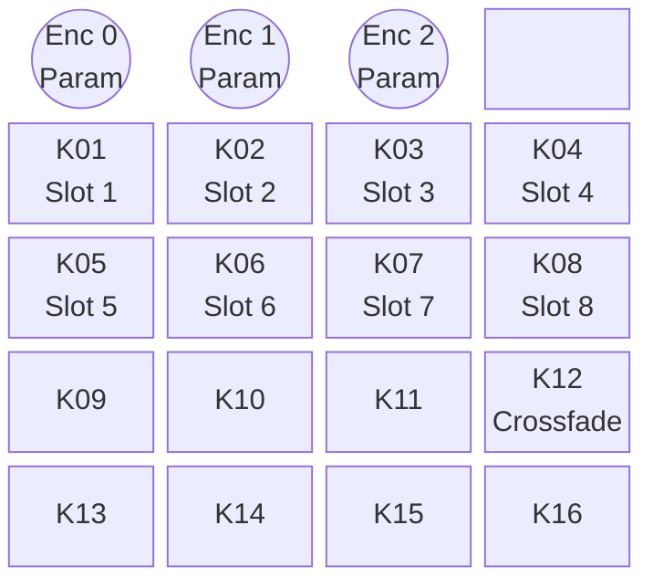
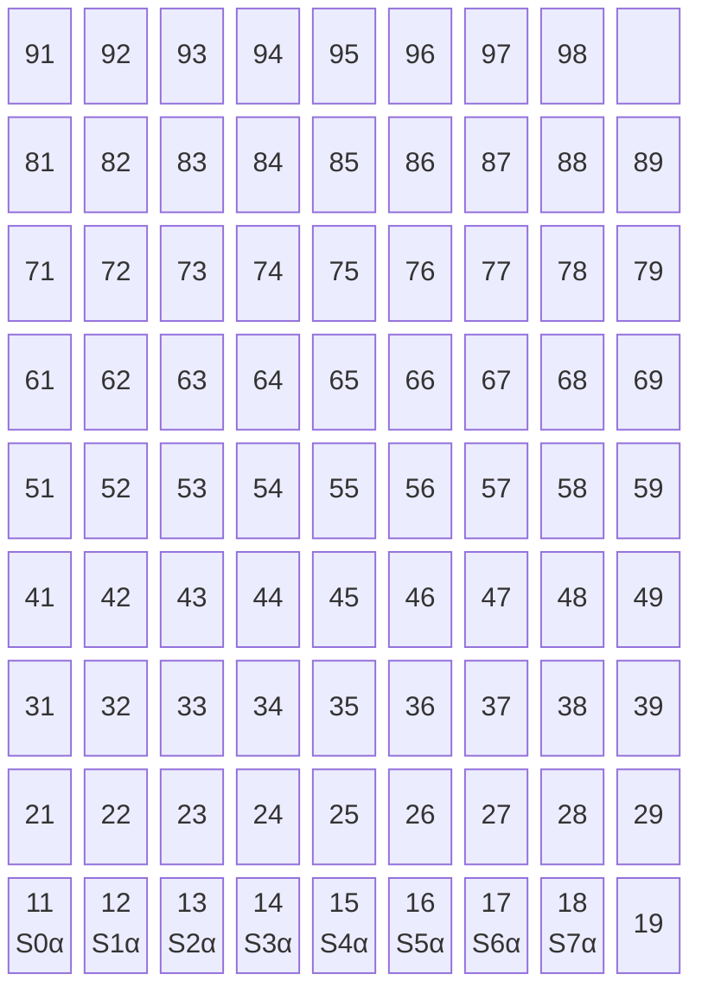
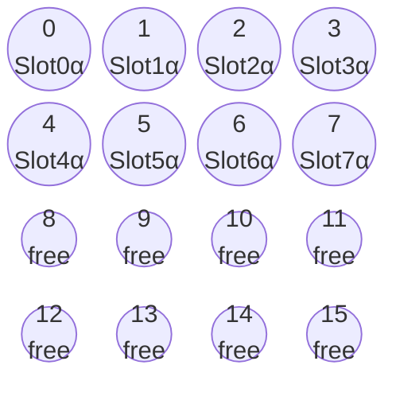
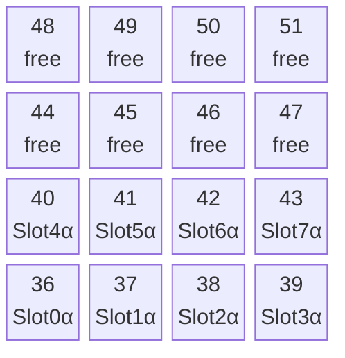
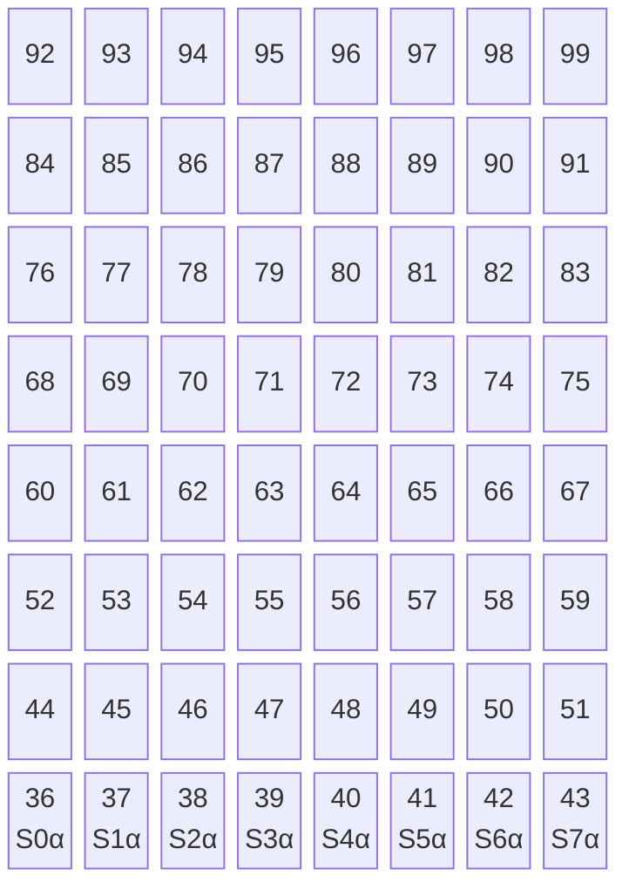

# Controller Reference

Hardware controller layouts and mappings for Slew.

---

## Akai Midimix

8-channel mixer-style controller with faders, knobs, and LED buttons.



Legend: `(( ))` = rotary knob (CC) · `[ ]` = button with LED (Note) · `[/ /]` = fader (CC) · α = Slot Alpha

### Mappings

| Control      | Type | CC/Note                 | Function                        |
| ------------ | ---- | ----------------------- | ------------------------------- |
| Fader 1-8    | CC   | 19,23,27,31,49,53,57,61 | Slot 1-8 Alpha                  |
| Master Fader | CC   | 62                      | Fade all slots                  |
| Knob Row 1   | CC   | 16,20,24,28,46,50,54,58 | Slot Param 1                    |
| Knob Row 2   | CC   | 17,21,25,29,47,51,55,59 | Slot Param 2                    |
| Knob Row 3   | CC   | 18,22,26,30,48,52,56,60 | Slot Param 3                    |
| Mute 1-8     | Note | 1,4,7,10,13,16,19,22    | Toggle audio reactivity (mute)  |
| Solo 1-8     | Note | 2,5,8,11,14,17,20,23    | Isolate slot (solo)             |
| Rec Arm 1-8  | Note | 3,6,9,12,15,18,21,24    | Slot exists indicator           |
| SEND ALL     | Note | 25                      | (No LED)                        |
| BANK LEFT    | Note | 26 (LED: 25)            | Beat indicator (pulses on beat) |
| BANK RIGHT   | Note | 27 (LED: 26)            | Beat indicator (pulses on beat) |
| Master SOLO  | Note | 28                      | (No LED)                        |

### LED Control

- LEDs respond to Note On (velocity > 0 = on, velocity 0 = off)
- **Mute LED**: ON = audio reactive, OFF = audio muted (or no sketch)
- **Solo LED**: OFF normally (could flash on press in future)
- **Rec Arm LED**: ON = slot has sketch loaded, OFF = empty slot
- **Bank Left/Right LEDs**: Pulse together on detected audio beats (BPM indicator)

**Note**: Master column LED note numbers are offset by 1 from button input notes:

- SEND ALL and Master SOLO buttons have no physical LEDs
- Bank Left button sends note 26, but LED responds to note 25
- Bank Right button sends note 27, but LED responds to note 26

### Button Functions

- **Mute buttons** (top row): Toggle audio reactivity for the slot
  - When muted, audio mappings targeting that slot are ignored
  - LED indicates current state (ON = audio active, OFF = muted)
- **Solo buttons** (middle row): Isolate the slot
  - Sets target slot alpha to 1.0, all other slots to 0.0
  - Transition uses smooth parameter animation
- **Rec Arm buttons** (bottom row): Currently indicator only

### Auto-Setup

On connect:

1. Input + Output paired automatically
2. Faders auto-mapped to slot alphas
3. Knobs auto-mapped to first 3 sketch parameters per slot
4. LED startup animation plays (cascade wave)

---

## DOIO Megalodon Macropad

16-key macropad with 3 rotary encoders. Connected via HID (not MIDI).



Legend: `(( ))` = rotary encoder with push · `[ ]` = mechanical key

### Mappings

| Control   | Function                           |
| --------- | ---------------------------------- |
| Keys 1-8  | Select slot for parameter control  |
| Key 12    | Trigger crossfade to selected slot |
| Encoder 0 | Control parameter on selected slot |
| Encoder 1 | Control parameter on selected slot |
| Encoder 2 | Control parameter on selected slot |

### HID Protocol

- Vendor ID: `0xD010` (53264)
- Product ID: `0x1601` (5633)
- Reports encoder deltas and key press/release events
- Auto-connects when plugged in

---

## Novation Launchpad (mk2 / Mini mk3 / Pro mk3 / X)

**Port name patterns (case-insensitive):**
- mk2: `Launchpad MK2`
- X: `Launchpad X`
- Mini mk3: `Launchpad Mini MK3`
- Pro mk3: `Launchpad Pro MK3`

**Layout:**



Top row = CC 104–111 (mk2) or Notes 91–98 (mk3/X). Right column = scene launch. Bottom row (11–18) auto-mapped to slot alphas.

**Default mappings (bottom row, notes 11–18):**

| Pad | Note | Parameter     | Mode    |
|-----|------|---------------|---------|
| 1   | 11   | slot_0_alpha  | trigger |
| 2   | 12   | slot_1_alpha  | trigger |
| 3   | 13   | slot_2_alpha  | trigger |
| 4   | 14   | slot_3_alpha  | trigger |
| 5   | 15   | slot_4_alpha  | trigger |
| 6   | 16   | slot_5_alpha  | trigger |
| 7   | 17   | slot_6_alpha  | trigger |
| 8   | 18   | slot_7_alpha  | trigger |

Trigger mode: Note On fires `max_value` (1.0), Note Off fires `min_value` (0.0).

**LED protocol:** Note On, channel 0 — velocity is the color palette index.
- Velocity 60 = bright green (used for startup indication on bottom-row pads)
- Velocity 0 = off

All four variants share the same startup LED sequence and mapping setup.
- Has MIDI output: **yes** (LED feedback)
- Auto-connects when plugged in

---

## DJ TechTools Midi Fighter Twister

16 endless rotary encoders with RGB LED rings, arranged in a 4×4 grid.



Each encoder: CC N ch0 (turn) · Note N ch1 (push). LED ring: CC N ch1, value 0–127.

### Mappings

| Control          | Type | Channel | CC/Note | Function              |
| ---------------- | ---- | ------- | ------- | --------------------- |
| Encoder 0–7      | CC   | 0       | 0–7     | Slot 0–7 Alpha        |
| Encoder 8–15     | CC   | 0       | 8–15    | (unmapped, free)      |
| Push buttons 0–15| Note | 1       | 0–15    | (available)           |

### LED Feedback

- Send CC on **channel 1**, CC 0–15 to set each encoder's LED ring position
- Value 0 = ring at zero position; value 127 = ring fully lit
- On connect, all 16 rings are reset to 0 (startup clear sequence)
- Has MIDI output: **yes**

### Auto-Setup

On connect:

1. Input + Output paired automatically
2. Encoders 0–7 auto-mapped to slot alphas
3. Startup LED clear sequence sends CC 0–15 (value 0) on channel 1

---

## Midi Fighter Spectra

4×4 RGB button grid, 16 pads. Channel 0 Note On/Off.



Each pad: Note N ch0. LED: Note On ch0 vel=color index, vel=0 off. Bottom row auto-mapped to slot alphas.

### Mappings

| Control     | Type | Channel | Note  | Function         |
| ----------- | ---- | ------- | ----- | ---------------- |
| Pad row 0   | Note | 0       | 36–39 | Slot 0–3 Alpha   |
| Pad row 1   | Note | 0       | 40–43 | Slot 4–7 Alpha   |
| Pad rows 2–3| Note | 0       | 44–51 | (unmapped, free) |

### LED Notes

- Send Note On **channel 0**, note = pad note, velocity = color index
- Velocity 0 = off, velocity 127 = white/full brightness
- On connect, all 16 pads receive Note On velocity 0 (startup clear)
- Has MIDI output: **yes**

### Auto-Setup

On connect:

1. Input + Output paired automatically
2. Bottom two rows (notes 36–43) auto-mapped to slot 0–7 alphas
3. Startup LED clear sequence sends Note On velocity 0 to all 16 pads

---

## Midi Fighter 64

8×8 RGB button grid, 64 pads. Channel 0 Note On/Off.



Each pad: Note N ch0. LED: Note On ch0 vel=color, vel=0 off. Bottom row auto-mapped to slot alphas.

### Mappings

| Control      | Type | Channel | Note  | Function         |
| ------------ | ---- | ------- | ----- | ---------------- |
| Pad row 0    | Note | 0       | 36–43 | Slot 0–7 Alpha   |
| Pad rows 1–7 | Note | 0       | 44–99 | (unmapped, free) |

### LED Notes

- Send Note On **channel 0**, note = pad note, velocity = color index
- Velocity 0 = off, velocity 127 = full brightness
- On connect, all 64 pads receive Note On velocity 0 (startup clear)
- Has MIDI output: **yes**

### Auto-Setup

On connect:

1. Input + Output paired automatically
2. Bottom row (notes 36–43) auto-mapped to slot 0–7 alphas
3. Startup LED clear sequence sends Note On velocity 0 to all 64 pads

---

## Adding New Controllers

Every controller needs two things: a **Rust backend profile** (auto-setup, LEDs) and a **TypeScript layout** (schematic UI). Both follow established patterns.

### 1. Rust backend (`src-tauri/src/midi/`)

**a) Constants** — add to `constants.rs`:
```rust
// Device name pattern (match against port name)
pub const MY_DEVICE_NAME_PATTERN: &str = "my device"; // lowercase for contains() match
// CC/Note arrays as needed
pub const MY_DEVICE_KNOB_CCS: [u8; 8] = [0, 1, 2, 3, 4, 5, 6, 7];
```

**b) Module** — create `src-tauri/src/midi/my_device.rs`:
```rust
//! My Device specific functionality.
use super::constants::*;
use super::mappings::install_default_cc_mappings; // or install_default_note_mappings
use super::output::send_note_on; // if LED feedback needed

pub fn setup_my_device_default_mappings() {
    log::debug!("[MIDI] Setting up My Device default mappings");
    install_default_cc_mappings(&MY_DEVICE_KNOB_CCS[..8]);
}

// Only needed if has_output: true
pub fn send_my_device_startup_leds(output_device_id: &str) {
    log::debug!("[MIDI] Sending My Device startup LEDs");
    let device_id = output_device_id.to_string();
    std::thread::spawn(move || {
        // ... send LED init messages
    });
}
```

**c) Register** — two places:

`mod.rs` — add:
```rust
pub(crate) mod my_device;
```

`engine.rs` — append to `CONTROLLERS` slice:
```rust
ControllerProfile {
    label: "My Device",
    matches: |name| name.to_ascii_lowercase().contains(MY_DEVICE_NAME_PATTERN),
    has_output: true, // false if no LED output
    setup: || super::my_device::setup_my_device_default_mappings(),
    startup_leds: Some(|id| super::my_device::send_my_device_startup_leds(id)),
    // or: startup_leds: None,
},
```
Also add a legacy helper if needed:
```rust
pub fn is_my_device(name: &str) -> bool {
    (CONTROLLERS[N].matches)(name) // N = index of your entry
}
```

**Available mapping helpers** (in `mappings.rs`):
- `install_default_cc_mappings(ccs: &[u8])` — maps CCs on ch0 to slot_N_alpha
- `install_default_note_mappings(notes: &[u8], channel: u8)` — maps notes to slot_N_alpha as Trigger

### 2. HID Controllers (`src-tauri/src/hid/`)

- Add a module in `src-tauri/src/hid/` following `megalodon.rs`
- Define Vendor/Product IDs
- Implement report parsing
- Register in `src-tauri/src/hid/devices.rs`

### 3. TypeScript layout (`src/inputs/deviceLayouts.ts`)

Add a `DeviceLayout` export with a builder function:
```typescript
function buildMyDeviceControls(): ControlDef[] {
  const controls: ControlDef[] = [];
  // Add knobs, faders, buttons, pads using { kind, col, row, cc/note, channel, label }
  // Grid is col/row based (0-indexed). Each cell = one control unit.
  return controls;
}

export const MY_DEVICE_LAYOUT: DeviceLayout = {
  name: "My Device",
  matchPattern: /my\s*device/i,  // matched against MIDI port name
  gridCols: 4,
  gridRows: 4,
  controls: buildMyDeviceControls(),
};
```

Append to `KNOWN_LAYOUTS` at the bottom of the file. Put more-specific name patterns **before** less-specific ones (e.g. "mk2" before "mk1").

**Control kinds:** `"knob"` | `"fader"` | `"button"` | `"pad"`

The `DeviceSchematic` component renders whatever is in `KNOWN_LAYOUTS` automatically — no other UI code changes needed.

### 4. Documentation

Add a section to this file (`docs/CONTROLLERS.md`) with:
- ASCII layout diagram (see existing sections for style)
- Mapping table (Control / Type / Channel / CC or Note / Function)
- LED protocol notes (if applicable)
- Auto-setup description

### Checklist

```
[ ] constants.rs — name pattern + CC/Note arrays
[ ] my_device.rs — setup_*() + startup_leds() if needed
[ ] mod.rs       — pub(crate) mod my_device;
[ ] engine.rs    — ControllerProfile entry + is_*() helper
[ ] deviceLayouts.ts — DeviceLayout export + added to KNOWN_LAYOUTS
[ ] CONTROLLERS.md   — ASCII diagram + mapping table
```
