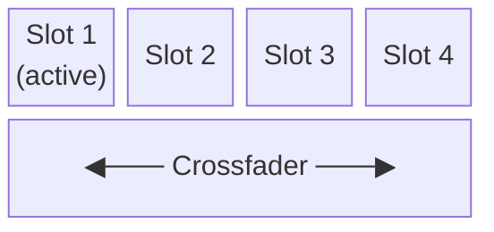

# Slots & Crossfader

Slew runs up to **4 slots** simultaneously. Each slot holds a sketch and its own set of parameters. The crossfader blends between the active slot and a target slot.

---

## Slots Overview

- **Active slot** — the slot currently rendering to the output
- **Target slot** — the slot you're fading to
- **Crossfader** — blends alpha between active and target (0 = full active, 1 = full target)

---

## Loading a Sketch

1. Click an empty slot column (shows sketch picker)
2. Search or browse by category
3. Click a sketch name to load it

The sketch loads instantly with default parameters. Previous parameters are restored if you reload the same sketch.

---

## Switching Slots

Click the **slot number** header (1–4) to make it active. The renderer switches output to that slot immediately.

To **crossfade** between slots:
1. Set up the target slot with a sketch
2. Drag the crossfader (bottom of the slots area) toward the target
3. The output blends between the two sketches

---

## Transition Controls (Left Panel)

The left panel shows controls for the active slot:

| Control | Description |
|---------|-------------|
| **Alpha** | Master opacity of this slot's output (0–1). Multiplied with the crossfader value. |
| **Transition** | Sets the crossfade curve — linear, ease-in, ease-out, etc. |

### Alpha

Alpha controls the overall transparency of the slot's rendered output before it reaches the final composite. Use it for:
- Fading a slot to black without losing the crossfade position
- Blending multiple active slots in overlay mode

Alpha is MIDI-mappable — assign a fader for live control.

---

## Sketch Parameters

Each sketch exposes its own parameters below the slot controls. These are sketch-specific (brightness, speed, color, etc.) and vary by sketch.

All sketch parameters are:
- **MIDI-mappable** — right-click or use MIDI learn mode
- **LFO-modulatable** — patch an LFO in the Modulation panel
- **Saved with presets** — see Presets below

---

## Presets

Each slot has a **Presets** section. Presets save and restore all sketch parameter values for that slot.

- **Save preset** — click `+` next to Presets, give it a name
- **Load preset** — click preset name in the list
- **Default preset** — loaded automatically when a sketch is first assigned

Presets are stored per-sketch, so switching sketches doesn't overwrite them.

---

## Copying a Slot

The `OR COPY FROM` footer in an empty slot lets you copy the full sketch + parameter state from another slot into this one. Useful for creating variations.

---

## Opening a Panel for a Slot

Each slot column has **Inputs / Outputs / Mod / FX** buttons at the bottom. These open the panel filtered to that specific slot — e.g., showing only MIDI mappings for slot 2's parameters.

---

## Dragging Slots

Slots can be reordered by dragging the slot column header. The crossfader position and all parameter state move with the slot.

---

## Projects

The full state of all slots (sketches, parameters, presets, FX chain, LFOs) is saved as a **Project**. Use the Projects panel to save, load, or export sessions.
